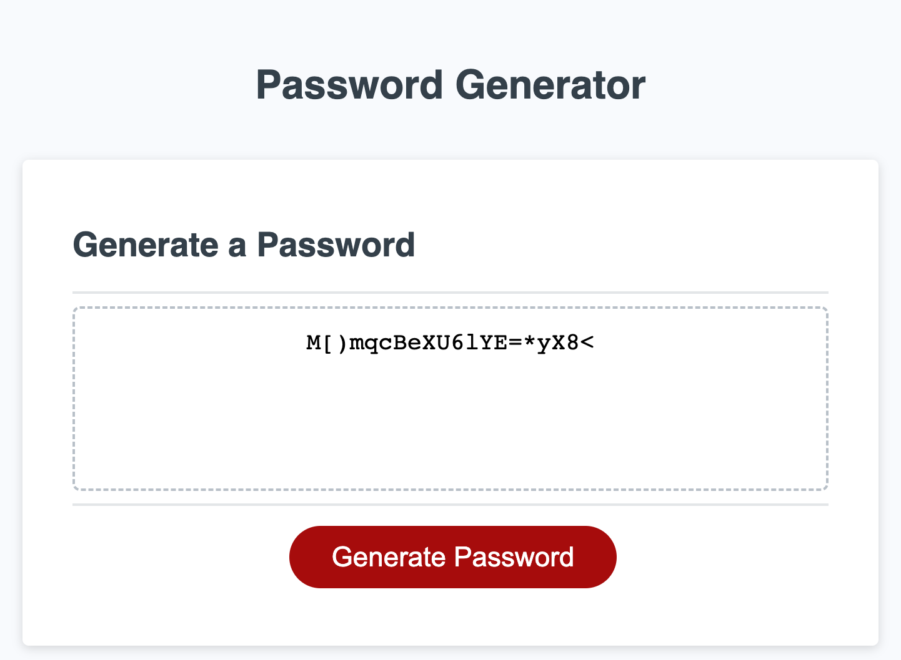

# random-password-generator

Description

The attached project file(s) are for our third challenge as part of the UC Berkeley full stack coding bootcamp. The goal of the challenge was to add to existing javascript code for a random password generator. Some of the key instructions for the project were to make sure that we leveraged a series or 'prompt' and 'confirm' functions, which would allow the user to decide on the content of the random password they received - whether it had upper / lower case letters, numeric, and / or special characters. 

This project tested my ability to use functions and helped me understand how they can be used in conjunction with other functions, as well as variables, to bring functionality to web pages.

Installation

No installation is required to enjoy the fruits of the project, simply visit the github pages URL.

Usage

In order to "use" the website, simply visit the URL and leverage Chrome's dev tools in order to take a look at the code that I created.

Credits

This project was created with helpful collaboration from bootcamp group 3, as well as my instructors and TAs.

Screenshot

link to project: https://t2na.github.io/random-password-generator/

License

MIT License

Copyright (c) 2023 t2na

Permission is hereby granted, free of charge, to any person obtaining a copy of this software and associated documentation files (the "Software"), to deal in the Software without restriction, including without limitation the rights to use, copy, modify, merge, publish, distribute, sublicense, and/or sell copies of the Software, and to permit persons to whom the Software is furnished to do so, subject to the following conditions:

The above copyright notice and this permission notice shall be included in all copies or substantial portions of the Software.

THE SOFTWARE IS PROVIDED "AS IS", WITHOUT WARRANTY OF ANY KIND, EXPRESS OR IMPLIED, INCLUDING BUT NOT LIMITED TO THE WARRANTIES OF MERCHANTABILITY, FITNESS FOR A PARTICULAR PURPOSE AND NONINFRINGEMENT. IN NO EVENT SHALL THE AUTHORS OR COPYRIGHT HOLDERS BE LIABLE FOR ANY CLAIM, DAMAGES OR OTHER LIABILITY, WHETHER IN AN ACTION OF CONTRACT, TORT OR OTHERWISE, ARISING FROM, OUT OF OR IN CONNECTION WITH THE SOFTWARE OR THE USE OR OTHER DEALINGS IN THE SOFTWARE.